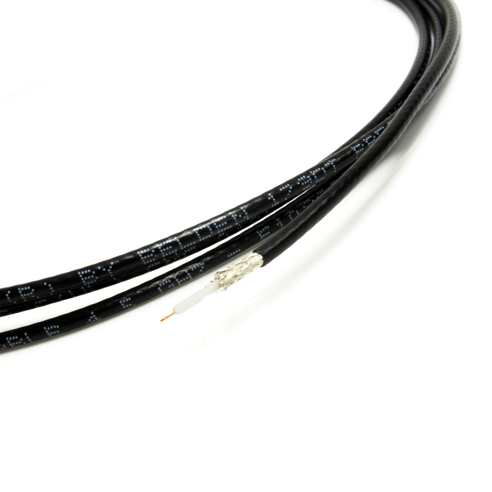
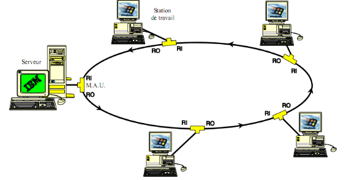
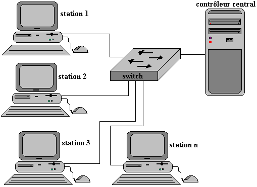

# Télé-Informatique et Réseau

Le **réseau informatique** est l'interconnection d'équipement informatiques
dans le but d'échanger des informations, de partager des resources
et d'améliorer les performances de l'ensemble.

### 1. Les types d'ordinateurs connectés
Dans un réseaux informatique, on peut distinguer des ordinateurs qualifiés
de *client* (ou poste de travail) et des ordinateurs qualifiés de *serveur*.
Ces dernières sont chargés de recevoir et de traiter des requêtes envoyées
par les *clients*. Les serveurs sont généralement des ordinateurs puissants
afin de disposer de la puissance nécessaire pour gérer dynamiquement
et rapidement toutes les requêtes provenant des postes de travail appartenant
au réseau ainsi établit.

### 2. Les types de réseaux
- Les réseaux **peer to peer** ou (poste à poste ou encore point à point)
sont de petits réseaux ne nécessitant pas la présence d'un serveur.
Dans ce genre de réseau, les ordinateurs connectés sont à la fois *clients
et serveur*. Chaque ordinateur est donc serveur des ressources dont-il dispose
pour servir un autre ordinateur qui en ce moment, joue le rôle de client.

- Les réseaux **lourds** ou architecture **client/serveur** sont de grands
réseaux
dans lesquels on note : la présence d'un serveur pour la gestion des ressources
disponibles dans le réseau et de leurs droits d'accès; et la présence
de clients pour accéder et utiliser ces ressources.

### 3. Classification des réseaux selon l'étendu
- Réseaux locaux (LAN) *Local Area Network* : réseau d'appreils se trouvant
dans un même bâtiments ou groupe de bâtiments proches.

- Réseaux métropolitiens (MAN) *Metropolitan Area Network* : réseaux
d'appareil couvrant un quartier ou groupe de quartier. Voire une ville tout
entière.

- Réseaux étendu (WAN) *Wide Area Network* : réseau s'étendant sur un pays,
un continent etc...

### 4. Les applications pouvant s'interconnectées entre eux

- Jeux en réseau;
- Le partage de fichier (Xender, ES explorer, etc...);
- Application centrale (Base de données, logiciels, etc...);
- Partage de connexion internet;
- Partage de périphériques.

### 5. Les types de serveurs

- Serveur d'application;
- Serveur d'imprimente;
- Serveur d'authentification;
- Serveur de fichiers;
- Serveur web.

### 6. La pair torsadée (Twisted Pair)

C'est un support de transmition filaire pour relier divers appareils
dans un réseau informatique. Ils existent sous deux formes :

- La pair torsadée blindée (Shielded Twisted Pair) : Chaque fil est recouvert
d'un papier en aluminium pour éviter la dyasphonie. Cette dernière
est un signal parasite, un bruit ou interférence ayant pour objectif de nuire
à la conduction des signaux.

- La pair torsadée non-blindée (Unshielded Twisted Pair) : Le papier
aluminium n'est pas présent dans ces genres de câble, mise à part que les fils
sont disposés en **torsade par pair**. Et cela toujours pour éviter
la dyasphonie. Deplus, lorsque deux fils sont torsadés ensemble,
les champs magnétiques qu'ils génèrent s'annulent mutuellement.

- Le câble droit : utilisé pour relier un ordinateur et un HUB ou un ordinateur
et un switch.

- Le câble croisé : utilisé pour relier deux équipements de même nature, comme
relier deux switchs, ou deux HUB ou deux ordinateurs entre eux.

La distance maximale d'une pair torsadée non-blindée est de **100 m** et celle
d'une pair torsadée blindée est de **150 m**.

La pair torsadée est munie d'un connecteur de type **RJ-45**. Ce connecteur
est disponible en cinq (05) catégories :

- Catégorie 1 (Téléphonie);
- Catégorie 2 (Téléphonie), $4$ Mb/s;
- Catégorie 3 (Réseau informatique) $10$ Mb/s;
- Catégorie 4 (Réseau informatique) $16$ Mb/s;
- Catégorie 5 (Réseau informatique) $100$ Mb/s, $1$ Gb/s.

### 7. Câble coaxial
Encore appelé câble Ethernet, c'est un câble résistant qui a la même structure
qu'un câble d'antenne de télévision. Il est un peu plus coûteux que la pair
torsadée. Le seul inconvenient, c'est qu'il a un faible débit. Un débit
qui ne dépasse pas les $10$ Mb/s. On distingue deux types de câble coaxial :

- Le câble coaxial fin (Thin Ethernet) : C'est un câble dont la couleur
est souvent **noire**. Le port de connexion de ce câble est le **RJ-58 U**
et est utilisé avec le connecteur **BNC** en I ou en T. Ce câble couvre
une distance maximale de **185 m**.

    

- Le câble coaxial gros (Think Ethernet) : Surnommé *yellow snake*,
c'est un câble dont la couleur est souvent **jaune**. Il est gros
et son port de connexion est le **RJ-11**. Ce câble couvre
une distance maximale de **500 m**.

### 8. La fibre optique
Il s'agit d'un câble permettant la transmission des données sur de longue
distance sous forme d'impulsion lumineuse. Ces mêmes impulsions lumineuses
sont converties en signal électrique au niveau des cartes réseaux pour divers
traitements. L'avantage est que contrairement aux câbles en cuivre,
la fibre optique est insensible aux interférences électromagnétiques.
Ce qui permet une transmission plus fiable des données.
Seulement que les fibres optiques sont très coûteux en argent.
Il exists deux (02) types de fibre optique :

- La fibre optique **monomode** : Conçue pour transmettre des signaux
sur de longues distances avec un seul chemin (canal) de lumière.
Elle couvre une distance maximale de **60 Km**.

- La fibre optique **multimode** (A gradient d'indice et à saut d'indice) :
Conçue pour transmettre des signaux avec plusieurs chemins de lumière.
Ce qui est idéal pour des distances plus courtes.
Elle couvre donc une distance maximale de **1 Km**.

Les connecteurs utilisés pour la fibre optique sont le connecteur
**ST** et **SC**.

### 9. Les liaisons sans fil
On distingue plusieurs types de liaisons sans fil :

- L'**infrarouge** (IrDA) : est une méthode de communication sans fil
qui utilise des rayonnements infrarouges pour transmettre des données.
Les signaux infrarouges ne traversent pas les murs. La lumière infrarouge
permet
de transmettre une grande quantité d'informations rapidement, ce qui est idéal
pour des applications nécessitant des débits élevés. Mais son débit est limité
à **115 Kb/s**. L'émétteur et le récepteur sont disposés face à face
pour correctement faire circuler le signal.

- Le **bluetooth** est une technologie de communication sans fil
qui permet l'échange de données entre des appareils sur de courtes distances.
Il permet de connecter divers appareils, tels que des smartphones,
des ordinateurs, des casques audio, et des imprimantes, sans nécessiter
de câbles physiques. Son débit de transmission est de **75 Kb/s**
à **1 Mb/s** avec une distance maximale de **100 m**.

- Les **faisseaux herziens**

- Le **wifi**

#### Mode infrastructure et Adhoc
Dans un réseau sans fil, le mode infrastructure nécessite un point d'accès
(AP) central qui contrôle la communication entre les appareils. Dans ce mode,
les appareils communiquent via le point d'accès, pas directement entre eux.
Ce mode est largement utilisé, notamment dans les lieux publics
comme les aéroports et les hôtels.

Tandis que, le mode Adhoc permet une communication directe entre les appareils
sans point d'accès central. Il est idéal pour des connexions temporaires
entre quelques appareils.

> Certains appareils ne supportent pas le mode adhoc et ne peuvent
se connecter qu'en mode infrastructure.

### 10. Les topologie
Elles sont sous deux formes. Nous avons les topologies physiques et logiques.
Nous allons parler ici des topologies physiques. Les topologies physiques
définissent la manière dont les différents composants du réseau sont reliés.

#### 10.1. Topologie en Bus
Cette topologie, encore appelée bus linéaire,
est montée en utilisant le câble coaxial avec des connecteurs BNC en I et en T
pour raccorder les différents postes de travail. Notez qu'a chaque extrémité,
on note la présence d'un **bouchon** ou **résistance de terminaison**.

    

Les résistances de terminaison sont utilisées pour absorber tout signal
arrivant à l'extrémité du câble afin d'éviter que le signal rebondis,
c'est-à-dire empêcher que le signal à $t$ se retourne (**réflexion**)
dans le réseaux pour pertuber le nouveau signal à $t + 1$.

Notez que la résistance de terminaison doit avoir la même inpédance
que celle du câble coaxial. Cette topologie a l'avantage d'être simple
à réaliser. Mais, il ne peut se faire uniquement qu'avec le **câble coaxial**.
De plus, la coupure d'un segment provoque la paralysie de tout le réseau.

#### 10.2. Topologie en Anneau
<!-- Cette topologie raccorde les différents poste de travail à un équipement
central appelé **MAU** (**M**ulti **A**ccess **U**nit). -->
Dans une topologie en anneau, les nœuds sont disposés de manière circulaire.
Chaque nœud (ordinateur) est connecté à deux autres nœuds, ce qui crée
une boucle continue.
Les données circulent dans un sens unique
(ou dans les deux sens dans certaines configurations) d'un nœud à l'autre.

- Passage des Données : Lorsqu'un nœud souhaite envoyer des données,
il les transmet au nœud suivant dans l'anneau. Chaque nœud reçoit les données,
les interprète et les retransmet au nœud suivant jusqu'à ce qu'elles atteignent
leur destination.

- Jeton de Contrôle : Dans de nombreux réseaux en anneau, un mécanisme appelé
**jeton** est utilisé. Seul le nœud qui détient le jeton peut envoyer
des données, ce qui évite les collisions. Une fois les données transmises,
le jeton est libéré et passe au nœud suivant, lui permettant d'envoyer
ses propres données.

- Régénération du Signal : Chaque nœud peut également régénérer le signal,
ce qui permet de maintenir la qualité des données sur de plus longues
distances.

    

Dans une topologie en anneau, les ordinateurs ne sont pas systématiquement
reliés en boucle directement. Ils peuvent être connectés à un équipement
central appelé **MAU** (**M**ulti **A**ccess **U**nit) qui va gérer
la communication entre les ordinateurs.

Le rôle du MAU dans un réseau en anneau est :
- Il permet de connecter plusieurs stations (ordinateur) à l'anneau;
- Il alloue un "temps de parole" à chaque station pour éviter les collisions;
- Il gère la communication entre les stations en leur permettant d'émettre
à tour de rôle.

#### 10.3. Topologie en Étoile
<!-- Cette topologie relie les différents postes du réseau à un équipement central
(Switch ou HUB). -->
Dans une topologie en étoile, chaque appareil est relié individuellement
au nœud central (Switch ou HUB). Les données circulent de l'appareil
source vers le nœud
central, qui les redirige ensuite vers leur destination. Cette structure
ressemble à une étoile, d'où son nom.

- Émetteur et Récepteur : Lorsqu'un appareil souhaite envoyer des données
à un autre, il les envoie d'abord au nœud central.
- Routage : Le nœud central reçoit les données et les transmet au nœud
de destination, ce qui permet une gestion efficace du trafic réseau.
- Indépendance des Nœuds : Si un nœud tombe en panne, cela n'affecte
pas le fonctionnement des autres nœuds, tant que le nœud central
reste opérationnel.

    

#### 10.4. Topologie maillé
Cette topologie est utilisée pour relier des routeurs entre eux. Le routeur
est un équipement d'interconnection dont l'objectif est de trouver
le chemin optimal, c'est à dire le chemin le plus court pour l'acheminement
des paquets.

Cette topologie a l'avantage d'offrir plusieurs cas possibles dans le câblage
des équipements. Pour déterminer le nombre de liaison d'une topologie
fortement maillée, s'il y a $n$ noeud(s), alors le nombre de liaison se calcule
comme suit :

$$
N = \frac{n (n - 1)}{2}
$$

L'inconveniant de cette topologie, c'est qu'il y a trop de câbles; trop
de cartes réseaux et donc très gourmande en équipement.

Point essentiel à noter :

- Dans les installations réseaux, la topologie la plus utilisée
est celle en **étoile**. On utilise souvent la **pair torsadée**
avec le connecteur **RJ-45**.

- Un **concentrateur** ou **HUB** : est un équipement qui lorsqu'il reçoit
une information d'un poste de travail (espéditeur), il la diffuse à toutes
les autres poste de travails sans exception.

- Un **Switch** ou **commutateur** : est un équipement qui lorsqu'il reçoit
une information d'un poste de travail (espéditeur), il l'envoie uniquement
à son destinataire.

> Le commutateur est plus chère que le concentrateur.

- Lorsqu'on parle de topologie *tout court*, sans préciser 
(physique ou logique), il faut comprendre par défaut qu'on parle
de la topologie physique.

- Il est possible de combiner **plusieurs topologies**. Dans ce cas, on parle
de **topologie mixte**. Les plus courantes sont : Anneau-étoilée, Bus-étoilée.

### 11. Les méthodes d'accès ou topologies logiques
Les méthodes d'accès définissent comment les informations sont arbitrées
dans le réseau avec les postes de travail.

- Les méthodes d'accès avec contention;
- Les méthodes d'accès sans contention;

### 12. Les grandes étapes du câblage
- Repérer les supports de transmission à utiliser;
- Trouver le ou les topologies à utiliser;
- Repérage du cheminement des câbles;
- L'utilisation des techniques de faux plancher et de faux plafonts;
- Pose des câbles et raccordement des équipements;
- L'étiquetage des câbles pour faciliter les maintenances;
- Le local technique qui n'est rien d'autre qu'une armoir regroupant divers
équipements (switch, HUB, Routeurs, etc...).

Pour faire un bon câblage, il faut faire :
- Le **câblage tertiaire** : liaison entre les pièces d'un immeuble;
raccordement entre les ordinateurs d'une même salle (Back bone).
- Le **câblage secondaire** : Liaison entre les étages d'un immeuble.
- Le **câblage primaire** : Liaison entre les immeubles.

### 13. Les protocoles
Le protocole est l'ensemble des règles utilisées pour effectuer
une communication. Il est à la base de toute communication entre les machines.
Nous avons les protocoles suivants :

- TCP/IP (**T**ransmission **C**ontrol **P**rotocol/**I**nternet **P**rotocol).
- IPX/SPX : c'est un protocole routable.

> Un protocole est routable lorsqu'il est en mesure de retrouver le chemin
optimal dans des réseaux hétérogènes.

Quelques informations utiles :

- Les protocoles routables sont : TCP/IP, IPX/SPX. 
- Les protocoles non routables sont : NetBEUI, NETBIOS.

## 14. Le modèle OSI
Le modèle **OSI** (**O**pen **S**tandard **I**nter-connection) a été mise
en place par *ISO* (International Standard Organization) pour permettre
à des stations hétérogènes de pouvoir se communiquer entre elles.
Pour inter-connecter deux différentes stations, il faut utiliser le modèle OSI
et le TCP/IP. Ces deux sont indispensables.

Le modèle OSI est organisé en 07 couches qui sont :
1. La couche physique;
2. La couche liaison de données;
3. La couche réseaux;
4. La couche transport;
5. La couche session;
6. La couche présentation;
7. La couche application.

- Les couches de 1 à 3 sont celles les plus proches du matériel (du physique).
- Les couches de 5 à 7 sont celles les plus proches du logiciel
(de l'utilisateur).
- La couche 4, représente le point de jonction des autres couches.

| Couches     | Type de donnée | Rôles | Exemples | Protocoles |
|-------------|----------------|-------|----------|----------|------------|
| Application | Message        | Gèrer le transport des informations entre programmes. | Logiciels de messagerie, de navigation, etc... | SMTP / POP / HTTP / TELNET / FTP|
| Présentation | Message       | Mise en forme des données, l'encryptage, la compression | Passerelles d'applications | SMTP / POP / HTTP / TELNET / FTP |
| Session     | Message | Etablissement, gestion et coordination des communications, synchronisation du dialogue, définition du mode de transmission. | Passerelles d'applications | SMTP / POP / HTTP / TELNET / FTP |
| Transport   | Segment | La segmentation des messages en paquets. | Passerelles de transport | UDP, TCP, SPX, NetBEUI, NETBIOS |
| Réseaux     | Paquet | Traitement et transfert de paquet | Le routeur | IP, IPX, ARP, RARP, ICMP |
| Liaison de données | Définit l'interface avec la carte réseaux. | Trame | Les ponts; commutateurs ou switch et le routeur | HDLC, LAP-B, LAP-D |
| Physique    | Bit | Gère les connexions matérielles et définit la façon dont les données sont converties en signaux numériques. | Les câbles, les connecteurs, etc..., adaptateurs, répéteurs et concentrateurs. | |

#### Comparaison avec le modèle TCP/IP

| N | Couche OSI         | Couche TCP/IP    |
|---|--------------------|------------------|
| 7 | Application        | Application      |
| 6 | Présentation       | Application      |
| 5 | Session            | Application      |
| 4 | Transport          | Transport        |
| 3 | Réseaux            | Internet         |
| 2 | Liaison de données | Accès réseaux    |
| 1 | Pysique            | Accès réseaux    |

#### Comparaisons avec les protocoles

| N | Couche OSI         | Couche TCP/IP    | Protocoles |
|---|--------------------|------------------|------------|
| 7 | Application        | Application      | SMTP / POP / TELNET / FTP/ HTTP |
| 6 | Présentation       | Application      | SMTP / POP / TELNET / FTP/ HTTP |
| 5 | Session            | Application      | SMTP / POP / TELNET / FTP/ HTTP |
| 4 | Transport          | Transport        | TCP / UDP / SPX |
| 3 | Réseaux            | Internet         | IP / ARP / ICMP / RARP / IPX |
| 2 | Liaison de données | Accès réseaux    | Accès réseaux |
| 1 | Pysique            | Accès réseaux    | Accès réseaux |

