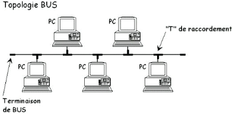

# Télé-Informatique et Réseau

Le **réseau informatique** est l'interconnection d'équipement informatiques
dans le but d'échanger des informations, de partager des resources
et d'améliorer les performances de l'ensemble.

### 1. Les types d'ordinateurs connectés
Dans un réseaux informatique, on peut distinguer des ordinateurs qualifiés
de *client* (ou poste de travail) et des ordinateurs qualifiés de *serveur*.
Ces dernières sont chargés de recevoir et de traiter des requêtes envoyées
par les *clients*. Les serveurs sont généralement des ordinateurs puissants
afin de disposer de la puissance nécessaire pour gérer dynamiquement
et rapidement toutes les requêtes provenant des postes de travail appartenant
au réseau ainsi établit.

### 2. Les types de réseaux
- Les réseaux **peer to peer** ou (poste à poste ou encore point à point)
sont de petits réseaux ne nécessitant pas la présence d'un serveur.
Dans ce genre de réseau, les ordinateurs connectés sont à la fois *clients
et serveur*. Chaque ordinateur est donc serveur des ressources dont-il dispose
pour servir un autre ordinateur qui en ce moment, joue le rôle de client.

- Les réseaux **lourds** ou architecture **client/serveur** sont de grands
réseaux
dans lesquels on note : la présence d'un serveur pour la gestion des ressources
disponibles dans le réseau et de leurs droits d'accès; et la présence
de clients pour accéder et utiliser ces ressources.

### 3. Classification des réseaux selon l'étendu
- Réseaux locaux (LAN) *Local Area Network* : réseau d'appreils se trouvant
dans un même bâtiments ou groupe de bâtiments proches.

- Réseaux métropolitiens (MAN) *Metropolitan Area Network* : réseaux
d'appareil couvrant un quartier ou groupe de quartier. Voire une ville tout
entière.

- Réseaux étendu (WAN) *Wide Area Network* : réseau s'étendant sur un pays,
un continent etc...

### 4. Les applications pouvant s'interconnectées entre eux

- Jeux en réseau;
- Le partage de fichier (Xender, ES explorer, etc...);
- Application centrale (Base de données, logiciels, etc...);
- Partage de connexion internet;
- Partage de périphériques.

### 5. Les types de serveurs

- Serveur d'application;
- Serveur d'imprimente;
- Serveur d'authentification;
- Serveur de fichiers;
- Serveur web.

### 6. La pair torsadée (Twisted Pair)

C'est un support de transmition filaire pour relier divers appareils
dans un réseau informatique. Ils existent sous deux formes :

- La pair torsadée blindée (Shielded Twisted Pair) : Chaque fil est recouvert
d'un papier en aluminium pour éviter la dyasphonie. Cette dernière
est un signal parasite, un bruit ou interférence ayant pour objectif de nuire
à la conduction des signaux.

- La pair torsadée non-blindée (Unshielded Twisted Pair) : Le papier
aluminium n'est pas présent dans ces genres de câble, mise à part que les fils
sont disposés en **torsade par pair**. Et cela toujours pour éviter
la dyasphonie. Deplus, lorsque deux fils sont torsadés ensemble,
les champs magnétiques qu'ils génèrent s'annulent mutuellement.

- Le câble droit : utilisé pour relier un ordinateur et un HUB ou un ordinateur
et un switch.

- Le câble croisé : utilisé pour relier deux équipements de même nature, comme
relier deux switchs, ou deux HUB ou deux ordinateurs entre eux.

La distance maximale d'une pair torsadée non-blindée est de **100m** et celle
d'une pair torsadée blindée est de **150m**.

La pair torsadée est munie d'un connecteur de type RJ45. Ce connecteur
est disponible en cinq (05) catégories :

- Catégorie 1 (Téléphonie);
- Catégorie 2 (Téléphonie), $4$ Mb/s;
- Catégorie 3 (Réseau informatique) $10$ Mb/s;
- Catégorie 4 (Réseau informatique) $16$ Mb/s;
- Catégorie 5 (Réseau informatique) $100$ Mb/s, $1$ Gb/s.

### 7. Câble coaxial
Encore appelé câble Ethernet, c'est un câble résistant qui a la même structure
qu'un câble d'antenne de télévision. Il est un peu plus coûteux que la pair
torsadée. Le seul inconvenient, c'est qu'il a un faible débit. Un débit
qui ne dépasse pas les $10$ Mb/s. On distingue deux types de câble coaxial :

- Le câble coaxial fin (Thin Ethernet) : C'est un câble dont la couleur
est souvent **noire**. Le port de connexion de ce câble est le **RG-58 U**
et est utilisé avec le connecteur **BNC** en I ou en T. Ce câble couvre
une distance maximale de **185m**.

    

- Le câble coaxial gros (Think Ethernet) : Surnommé *yellow snake*,
c'est un câble dont la couleur est souvent **jaune**. Il est gros
et son port de connexion est le **RG-11**. Ce câble couvre
une distance maximale de **500m**.

### 8. La fibre optique
Il s'agit d'un câble permettant la transmission des données sur de longue
distance sous forme d'impulsion lumineuse. Ces mêmes impulsions lumineuses
sont converties en signal électrique au niveau des cartes réseaux pour divers
traitements. L'avantage est que contrairement aux câbles en cuivre,
la fibre optique est insensible aux interférences électromagnétiques.
Ce qui permet une transmission plus fiable des données.
Seulement que les fibres optiques sont très coûteux en argent.
Il exists deux (02) types de fibre optique :

- La fibre optique **monomode** : Conçue pour transmettre des signaux
sur de longues distances avec un seul chemin (canal) de lumière.
Elle couvre une distance maximale de **60Km**.

- La fibre optique **multimode** (A gradient d'indice et à saut d'indice) :
Conçue pour transmettre des signaux avec plusieurs chemins de lumière.
Ce qui est idéal pour des distances plus courtes.
Elle couvre donc une distance maximale de **1Km**.

Les connecteurs utilisés pour la fibre optique sont le connecteur
**ST** et **SC**.

### 9. Les liaisons sans fil
On distingue plusieurs types de liaisons sans fil :

- L'**infrarouge** (IrDA) : est une méthode de communication sans fil
qui utilise des rayonnements infrarouges pour transmettre des données.
Les signaux infrarouges ne traversent pas les murs. La lumière infrarouge
permet
de transmettre une grande quantité d'informations rapidement, ce qui est idéal
pour des applications nécessitant des débits élevés. Mais son débit est limité
à **115Kb/s**. L'émétteur et le récepteur sont disposés face à face
pour correctement faire circuler le signal.

- Le **bluetooth** est une technologie de communication sans fil
qui permet l'échange de données entre des appareils sur de courtes distances.
Il permet de connecter divers appareils, tels que des smartphones,
des ordinateurs, des casques audio, et des imprimantes, sans nécessiter
de câbles physiques. Son débit de transmission est de **75Kb/s**
à **1Mb/s** avec une distance maximale de **100m**.

- Les **faisseaux herziens**

- Le **wifi**

#### Mode infrastructure et Adhoc
Dans un réseau sans fil, le mode infrastructure nécessite un point d'accès
(AP) central qui contrôle la communication entre les appareils. Dans ce mode,
les appareils communiquent via le point d'accès, pas directement entre eux.
Ce mode est largement utilisé, notamment dans les lieux publics
comme les aéroports et les hôtels.

Tandis que, le mode Adhoc permet une communication directe entre les appareils
sans point d'accès central. Il est idéal pour des connexions temporaires
entre quelques appareils.

> Certains appareils ne supportent pas le mode adhoc et ne peuvent
se connecter qu'en mode infrastructure.

### 10. Les topologie
Elles sont sous deux formes. Nous avons les topologies physiques et logiques.
Nous allons parler ici des topologies physiques. Les topologies physiques
définissent la manière dont les différents composants du réseau sont reliés.

- Les **topologie en bus** : Cette topologie, encore appelée bus linéaire,
est montée en utilisant le câble coaxial avec des connecteurs BNC en I et en T
pour raccorder les différents postes de travail. Notez qu'a chaque extrémité,
on note la présence d'un **bouchon** ou **résistance de terminaison**.

    

